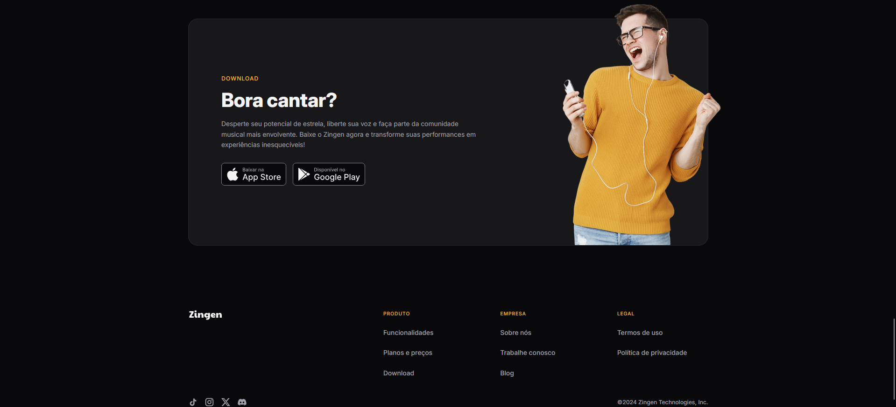

# Projeto Zingen

Pagina web responsiva desenvolvida durante o primeiro módulo do curso MBA FullStack - Rocketseat + Faculdade Sirius

## Tech Stack

**Client:** HTML, CSS, Mobile Ready

## Features

- Grid Layout
- CSS Variables
- @Media
- Cards

## Authors

- [@marcionavas](https://github.com/marcionavas)

## Screenshots

## Acknowledgements

 - [Rocketseat](https://rocketseat.com.br)
 - [Faculdade Sirius](https://faculdadesirius.edu.br/)